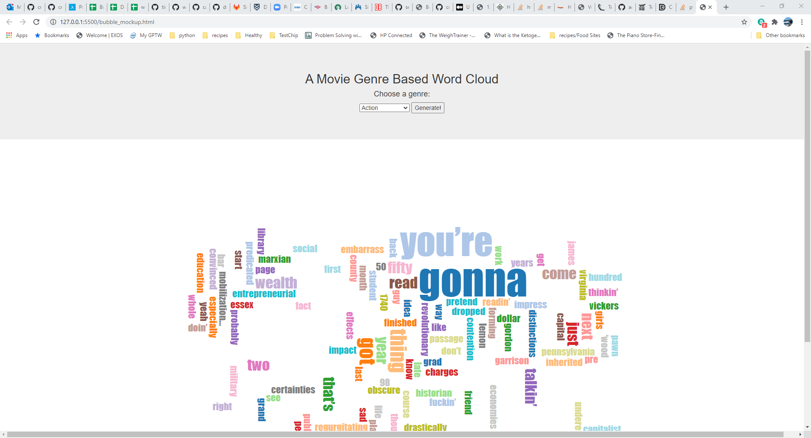
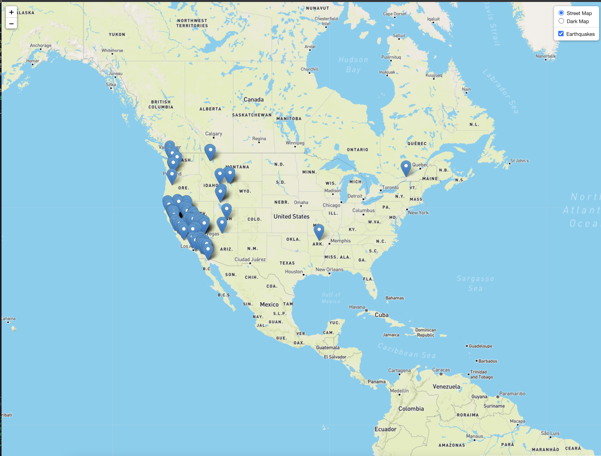

# Movie Visualizations

One Paragraph of project description goes here

## Getting Started

1. Create a flask app using MongoDB.
    * Create an ETL file that parses the CSV and creates the MongoDB.
    * The data we selected is The Movies Dataset from kaggle: <https://www.kaggle.com/rounakbanik/the-movies-dataset>
2. The flask app will consist of a layout.html and "Visualization".html files. The layout has a standard header/footer/navbar to inherit.
3. We are using Movie DB information to provide the following visuals:
    * We have a Bubble diagram of the keywords associates with each genre of movie.
        * Here is an example: <https://bl.ocks.org/jyucsiro/767539a876836e920e38bc80d2031ba7>
        * Note: This is called cloud.js, and it extends d3. We are using this library for this project.
        * Note: there may be thick manipulations on the data if the word count is too long.
    * The second Visualization is a scatter plot of profit versus budget with the dots color-coded based upon the movie genre.
    * The final Visualization will showcase a world map of movie production countries. It will showcase via pop-up the highest-grossing movie for each country. The pop-up will appear when a user clicks on the country.

## Deployment

To demo this site, run all of the cells in the ETL.ipynb file. This will clean the data and load the MongoDB with the data. Then run the app.py file.

## Built With

* [D3 Wordcloud](https://bl.ocks.org/jyucsiro/767539a876836e920e38bc80d2031ba7) - The framework for the bubble diagram
* [Kaggle](https://www.kaggle.com/rounakbanik/the-movies-dataset) - Data source for project

## Authors

* **Sean Galloway**
* **Eliot Chern**
* **Cora Micsunescu**

## Acknowledgments

* Our instructional team, Erik Conser and Andrew Morrison, for answering our questions during office hours.
* <https://ibb.co/zxFhyMp> the IMG for my visualization proposal, credited to <https://towardsdatascience.com/>

